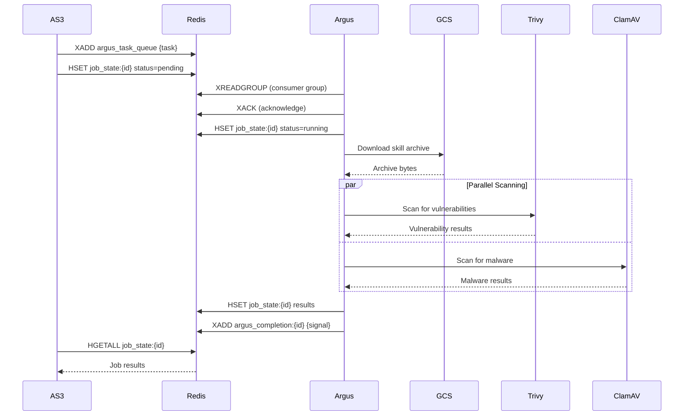

# AS3 Integration Guide

HikmaArgus integrates with the AS3 (Agent Skill Security Service) platform for enterprise-grade skill scanning. This document describes the Redis Streams protocol, GCS integration, task format, and deployment configuration.

## Overview

The AS3 integration enables:

- **Async Task Processing**: AS3 publishes scan tasks; Argus processes asynchronously
- **Horizontal Scaling**: Consumer groups allow multiple Argus instances
- **Real-time Status**: Job state in Redis for AS3 polling
- **Multi-Scanner Execution**: Parallel Trivy + ClamAV analysis
- **Multi-Tenant Isolation**: Configurable Redis key prefix

## Architecture



## Configuration

### Enable AS3 Integration

**Via CLI flags:**

```bash
hikmaai-argus daemon \
  --argus-worker \
  --redis-addr localhost:6379 \
  --redis-prefix "prod:" \
  --gcs-bucket hikma-skills \
  --gcs-download-dir /tmp/argus/downloads
```

**Via config file:**

```yaml
# Redis configuration
redis:
  enabled: true
  addr: localhost:6379
  password: ""           # Optional
  db: 0
  prefix: "argus:"       # Multi-tenant key prefix
  pool_size: 10
  read_timeout: 5s
  write_timeout: 5s

# GCS configuration
gcs:
  enabled: true
  bucket: hikma-skills
  project_id: ""         # Optional for ADC
  credentials_file: ""   # Optional, uses ADC if empty
  download_dir: /tmp/argus/downloads

# Argus worker configuration
argus_worker:
  enabled: true
  task_queue: argus_task_queue
  consumer_group: argus-workers
  consumer_name: ""      # Auto-generated from hostname
  completion_prefix: argus_completion
  workers: 2
  default_timeout: 15m
  max_retries: 3
  cleanup_on_complete: true
  state_ttl: 168h        # 7 days
```

## Redis Protocol

### Key Naming Convention

All keys use the configurable prefix for multi-tenant isolation:

```
{prefix}argus_task_queue          # Input task stream
{prefix}job_state:{job_id}        # Job status hash
{prefix}argus_completion:{job_id} # Completion signal stream
```

Example with prefix `prod:`:
```
prod:argus_task_queue
prod:job_state:job_abc123
prod:argus_completion:job_abc123
```

### Task Queue (Redis Stream)

**Stream:** `{prefix}argus_task_queue`

AS3 publishes tasks using XADD:

```bash
XADD prod:argus_task_queue * data '{"job_id":"job_abc123",...}'
```

**Task Message Format:**

```json
{
  "job_id": "job_abc123",
  "report_id": "report_456",
  "organization_id": "org_789",
  "parent_task_id": "task_000",
  "gcs_uri": "gs://hikma-skills/org_789/skills/my-skill.zip",
  "scanners": ["trivy", "clamav"],
  "timeout_seconds": 900,
  "created_at": "2024-01-01T12:00:00Z"
}
```

**Task Fields:**

| Field | Type | Required | Description |
|-------|------|----------|-------------|
| `job_id` | string | Yes | Unique job identifier |
| `report_id` | string | Yes | Associated report ID |
| `organization_id` | string | Yes | Organization for path validation |
| `parent_task_id` | string | No | Parent task for correlation |
| `gcs_uri` | string | Yes | GCS URI to skill archive |
| `scanners` | array | Yes | Scanners to run: `["trivy"]`, `["clamav"]`, or `["trivy", "clamav"]` |
| `timeout_seconds` | int | No | Custom timeout (default: 900) |
| `created_at` | string | No | ISO 8601 timestamp |

### Consumer Groups

Argus uses Redis consumer groups for reliable, scalable processing:

```bash
# Create consumer group (automatic)
XGROUP CREATE prod:argus_task_queue argus-workers $ MKSTREAM

# Read as consumer
XREADGROUP GROUP argus-workers argus-1 COUNT 1 BLOCK 5000 STREAMS prod:argus_task_queue >

# Acknowledge processing
XACK prod:argus_task_queue argus-workers <message_id>
```

**Scaling:** Multiple Argus instances join the same consumer group. Redis distributes messages across consumers.

### Job State (Redis Hash)

**Key:** `{prefix}job_state:{job_id}`

Argus updates job state throughout processing:

```bash
# Initialize
HSET prod:job_state:job_abc123 \
  argus_status '{"trivy":"pending","clamav":"pending"}' \
  started_at "2024-01-01T12:00:01Z"

# Update scanner status
HSET prod:job_state:job_abc123 trivy_status "running"

# Store results
HSET prod:job_state:job_abc123 \
  trivy_status "completed" \
  trivy_results '{"summary":{"total":5},...}'

# Completion
HSET prod:job_state:job_abc123 \
  completed_at "2024-01-01T12:05:00Z"
```

**State Fields:**

| Field | Description |
|-------|-------------|
| `argus_status` | JSON: `{"trivy": "status", "clamav": "status"}` |
| `started_at` | ISO 8601 timestamp |
| `completed_at` | ISO 8601 timestamp |
| `trivy_status` | pending, running, completed, failed |
| `trivy_results` | JSON: Trivy scan results |
| `clamav_status` | pending, running, completed, failed |
| `clamav_results` | JSON: ClamAV scan results |
| `error` | Error message if failed |
| `errors` | JSON: Per-scanner errors |

### Completion Signal (Redis Stream)

**Stream:** `{prefix}argus_completion:{job_id}`

Argus publishes when processing completes:

```bash
XADD prod:argus_completion:job_abc123 * data '{"job_id":"job_abc123","status":"completed",...}'
```

**Completion Signal Format:**

```json
{
  "job_id": "job_abc123",
  "status": "completed",
  "completed_at": "2024-01-01T12:05:00Z",
  "results": {
    "trivy": {
      "summary": {
        "total_vulnerabilities": 5,
        "critical": 1,
        "high": 3,
        "medium": 1,
        "low": 0
      },
      "vulnerabilities": [...]
    },
    "clamav": {
      "files_scanned": 42,
      "infected_files": 0,
      "detections": []
    },
    "errors": null
  }
}
```

**Status Values:**

| Status | Description |
|--------|-------------|
| `completed` | All scanners succeeded |
| `partial` | Some scanners failed; partial results available |
| `failed` | Processing failed completely |

## GCS Integration

### URI Format

```
gs://{bucket}/{organization_id}/skills/{skill_name}.zip
```

Example:
```
gs://hikma-skills/org_789/skills/data-analyzer.zip
```

### Organization Path Validation

Argus validates that the GCS path matches the organization ID to prevent cross-tenant access:

```go
// Path must contain organization prefix
// gs://bucket/org_789/... → org_id must be "org_789"
if !strings.Contains(gcsURI, "/"+organizationID+"/") {
    return ErrInvalidOrganizationPath
}
```

### Authentication

GCS authentication uses Application Default Credentials (ADC):

1. **Service Account Key** (if `credentials_file` is set):
   ```yaml
   gcs:
     credentials_file: /path/to/service-account.json
   ```

2. **Workload Identity** (GKE recommended):
   ```yaml
   gcs:
     # credentials_file not set, uses pod service account
   ```

3. **Local Development** (gcloud CLI):
   ```bash
   gcloud auth application-default login
   ```

### Download Flow

```
1. Parse GCS URI → bucket + object path
2. Validate organization path
3. Download to temp directory: {download_dir}/{job_id}/
4. Extract archive if .zip, .tar, .gz, .tgz
5. Return local path for scanning
6. Cleanup on completion (if cleanup_on_complete: true)
```

## Scanner Execution

### Parallel Execution

Trivy and ClamAV run in parallel using goroutines:

```go
var wg sync.WaitGroup
var trivyResult *TrivyResults
var clamResult *ClamAVResults

wg.Add(2)

go func() {
    defer wg.Done()
    trivyResult, _ = runner.RunTrivy(ctx, path)
}()

go func() {
    defer wg.Done()
    clamResult, _ = runner.RunClamAV(ctx, path)
}()

wg.Wait()
```

### Fail-Open Semantics

Individual scanner failures do not abort the task:

- If Trivy fails but ClamAV succeeds → Status: `partial`
- If both fail → Status: `failed`
- Partial results are still stored and returned

### Result Aggregation

**Trivy Results:**

```json
{
  "summary": {
    "total_vulnerabilities": 5,
    "critical": 1,
    "high": 3,
    "medium": 1,
    "low": 0,
    "packages_scanned": 42
  },
  "vulnerabilities": [
    {
      "package": "requests",
      "version": "2.25.0",
      "ecosystem": "pip",
      "cve_id": "CVE-2023-32681",
      "severity": "HIGH",
      "title": "Unintended leak of Proxy-Authorization header",
      "fixed_version": "2.31.0"
    }
  ],
  "scan_time_ms": 1500.5
}
```

**ClamAV Results:**

```json
{
  "files_scanned": 42,
  "infected_files": 1,
  "detections": [
    {
      "file_path": "scripts/backdoor.py",
      "detection": "Python.Trojan.Agent-12345",
      "threat_type": "trojan",
      "severity": "critical"
    }
  ],
  "scan_time_ms": 3500.0
}
```

## AS3 Polling Pattern

AS3 polls job state using Redis HGETALL:

```python
import redis
import json

r = redis.Redis(host='localhost', port=6379)
prefix = "prod:"

def get_job_status(job_id: str) -> dict:
    key = f"{prefix}job_state:{job_id}"
    data = r.hgetall(key)

    result = {}
    for field, value in data.items():
        field = field.decode()
        value = value.decode()

        # Parse JSON fields
        if field in ('argus_status', 'trivy_results', 'clamav_results', 'errors'):
            result[field] = json.loads(value)
        else:
            result[field] = value

    return result

# Usage
status = get_job_status("job_abc123")
print(f"Trivy: {status['argus_status']['trivy']}")
print(f"ClamAV: {status['argus_status']['clamav']}")
```

## Deployment

### Single Instance

```bash
hikmaai-argus daemon \
  --argus-worker \
  --redis-addr redis:6379 \
  --redis-prefix "prod:" \
  --gcs-bucket hikma-skills
```

### Horizontal Scaling (Kubernetes)

```yaml
apiVersion: apps/v1
kind: Deployment
metadata:
  name: argus-worker
spec:
  replicas: 3  # Multiple workers
  selector:
    matchLabels:
      app: argus-worker
  template:
    metadata:
      labels:
        app: argus-worker
    spec:
      serviceAccountName: argus-worker  # For Workload Identity
      containers:
      - name: argus
        image: hikmaai/argus:latest
        args:
        - daemon
        - --argus-worker
        - --redis-addr=redis:6379
        - --redis-prefix=prod:
        - --gcs-bucket=hikma-skills
        env:
        - name: CONSUMER_NAME
          valueFrom:
            fieldRef:
              fieldPath: metadata.name
        resources:
          requests:
            memory: "512Mi"
            cpu: "500m"
          limits:
            memory: "2Gi"
            cpu: "2"
```

### Redis Setup

```yaml
apiVersion: v1
kind: Service
metadata:
  name: redis
spec:
  ports:
  - port: 6379
  selector:
    app: redis
---
apiVersion: apps/v1
kind: Deployment
metadata:
  name: redis
spec:
  replicas: 1
  selector:
    matchLabels:
      app: redis
  template:
    metadata:
      labels:
        app: redis
    spec:
      containers:
      - name: redis
        image: redis:7-alpine
        ports:
        - containerPort: 6379
        resources:
          requests:
            memory: "256Mi"
            cpu: "100m"
```

## Error Handling

### Task Validation Errors

Invalid tasks are acknowledged but not processed:

```json
{
  "job_id": "",
  "error": "validation failed: job_id is required"
}
```

### GCS Errors

| Error | Handling |
|-------|----------|
| Object not found | Fail task with error message |
| Permission denied | Fail task; check service account |
| Invalid organization path | Fail task; security violation |
| Download timeout | Fail task; retry externally |

### Scanner Errors

| Error | Handling |
|-------|----------|
| Trivy timeout | Mark trivy_status=failed; continue |
| ClamAV not available | Mark clamav_status=failed; continue |
| Both scanners fail | Status=failed; no partial results |

## Monitoring

### Key Metrics

| Metric | Source |
|--------|--------|
| Tasks processed | Redis XINFO GROUPS |
| Processing time | Job completed_at - started_at |
| Scanner success rate | Results with/without errors |
| Queue depth | XLEN argus_task_queue |

### Logging

Argus logs all operations with structured fields:

```json
{
  "level": "info",
  "msg": "task completed",
  "job_id": "job_abc123",
  "org_id": "org_789",
  "status": "completed",
  "duration": "45.5s",
  "trivy_vulns": 5,
  "clamav_detections": 0
}
```

### Health Checks

```bash
# Check worker is running
curl http://localhost:8080/api/v1/health

# Check Redis connection
redis-cli -h redis PING

# Check consumer group
redis-cli -h redis XINFO GROUPS prod:argus_task_queue
```

## Troubleshooting

### Task Not Processing

1. Check consumer group exists:
   ```bash
   redis-cli XINFO GROUPS prod:argus_task_queue
   ```

2. Check pending messages:
   ```bash
   redis-cli XPENDING prod:argus_task_queue argus-workers
   ```

3. Verify Argus is connected:
   ```bash
   grep "argus worker starting" /var/log/argus/argus.log
   ```

### GCS Download Failures

1. Check credentials:
   ```bash
   gcloud auth application-default print-access-token
   ```

2. Verify bucket access:
   ```bash
   gsutil ls gs://hikma-skills/
   ```

3. Check organization path:
   ```bash
   # URI must contain /{org_id}/ path component
   ```

### Scanner Failures

1. Check Trivy availability:
   ```bash
   trivy --version
   ```

2. Check ClamAV:
   ```bash
   clamscan --version
   ls /var/lib/clamav/  # Check for CVD files
   ```

3. Check scan timeout:
   ```yaml
   # Increase if scans timeout
   argus_worker:
     default_timeout: 30m
   ```
