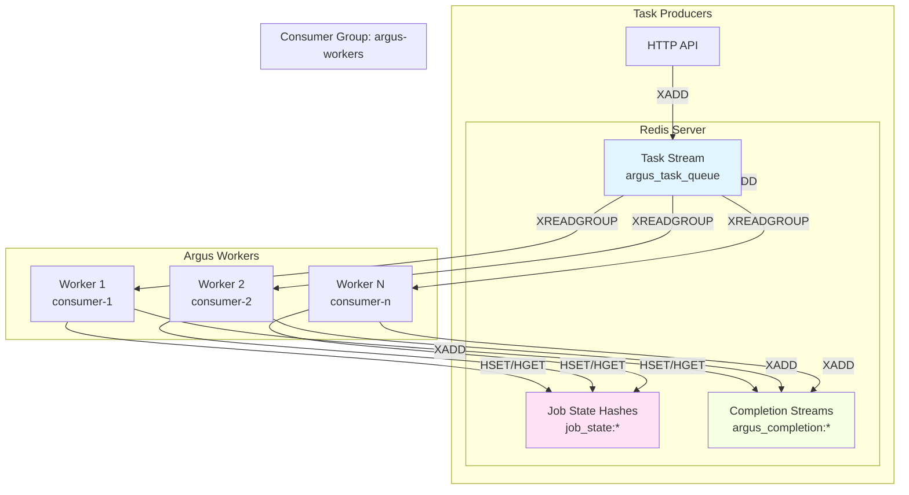

# Redis Integration

## Overview

HikmaAI Argus uses Redis as the backbone for distributed task processing and state management in enterprise deployments. The integration provides three core components: a prefixed client for multi-tenant isolation, a Streams consumer for distributed task queues, and a state manager for job tracking.

**Primary Use Case**: Redis platform integration for enterprise skill scanning workflows.

**Key Features**:
- Multi-tenant key isolation via configurable prefixes
- Redis Streams with consumer groups for horizontal scaling
- Hash-based state storage with TTL management
- Connection pooling and health checks

## Architecture



## Components

### 1. Client (`internal/redis/client.go`)

The base client wraps go-redis with automatic key prefixing for multi-tenant deployments.

**Key Features**:
- Automatic prefix application to all keys
- Connection pooling with configurable size
- Read/write timeouts
- Health check via PING

**Configuration**:

```go
type Config struct {
    Addr         string        // Redis server address (host:port)
    Password     string        // Authentication (optional)
    DB           int           // Database number (0-15)
    Prefix       string        // Key prefix for multi-tenancy
    PoolSize     int           // Connection pool size (default: 10)
    ReadTimeout  time.Duration // Read timeout (default: 5s)
    WriteTimeout time.Duration // Write timeout (default: 5s)
}
```

**Usage**:

```go
client, err := redis.NewClient(redis.Config{
    Addr:   "localhost:6379",
    Prefix: "argus:",
})
if err != nil {
    return fmt.Errorf("creating redis client: %w", err)
}
defer client.Close()

// Keys are automatically prefixed
// "job:123" becomes "argus:job:123"
err = client.Set(ctx, "job:123", "processing", 1*time.Hour)
```

### 2. Stream Consumer (`internal/redis/streams.go`)

Implements Redis Streams consumer groups for distributed task processing with exactly-once delivery semantics.

**Key Features**:
- XREADGROUP for consumer group support
- Automatic group creation with MKSTREAM
- Configurable blocking timeout
- Message acknowledgment (XACK)
- Publishing capability (XADD)

**Configuration**:

```go
type StreamConsumerConfig struct {
    Stream        string        // Stream name (without prefix)
    ConsumerGroup string        // Consumer group name
    ConsumerName  string        // Unique consumer identifier
    BlockTimeout  time.Duration // Block timeout (0 = indefinite)
    StartID       string        // ">" for new messages, "0" for pending
}
```

**Usage**:

```go
consumer, err := redis.NewStreamConsumer(client, redis.StreamConsumerConfig{
    Stream:        "argus_task_queue",
    ConsumerGroup: "argus-workers",
    ConsumerName:  "worker-1",
    BlockTimeout:  5 * time.Second,
})
if err != nil {
    return fmt.Errorf("creating stream consumer: %w", err)
}

// Ensure the consumer group exists (idempotent)
if err := consumer.EnsureGroup(ctx); err != nil {
    return fmt.Errorf("ensuring consumer group: %w", err)
}

// Read messages
messages, err := consumer.Read(ctx, 10)
if err != nil {
    return fmt.Errorf("reading messages: %w", err)
}

for _, msg := range messages {
    // Process message...

    // Acknowledge after successful processing
    if err := consumer.Ack(ctx, msg.ID); err != nil {
        log.Printf("failed to ack message %s: %v", msg.ID, err)
    }
}
```

**Message Format**:

```json
{
    "job_id": "job-abc-123",
    "report_id": "report-xyz-456",
    "organization_id": "org-789",
    "gcs_uri": "gs://bucket/path/to/skill.zip",
    "scanners": "[\"trivy\",\"clamav\"]",
    "timeout_seconds": "300",
    "created_at": "1706500000"
}
```

### 3. State Manager (`internal/redis/state.go`)

Manages job state using Redis Hash data structures for atomic field updates and efficient storage.

**Key Features**:
- Hash-based storage (HSET/HGET/HGETALL)
- JSON serialization for complex objects
- Configurable TTL with automatic expiration
- Atomic multi-field updates

**Configuration**:

```go
type StateManagerConfig struct {
    KeyPrefix  string        // Prefix for state keys (e.g., "job_state:")
    DefaultTTL time.Duration // Default TTL for state entries
}
```

**Usage**:

```go
state := redis.NewStateManager(client, redis.StateManagerConfig{
    KeyPrefix:  "job_state:",
    DefaultTTL: 7 * 24 * time.Hour, // 7 days
})

// Initialize job state
err := state.InitState(ctx, "job-123", map[string]string{
    "status":       "pending",
    "trivy_status": "queued",
    "clamav_status": "queued",
})

// Update individual field
err = state.SetField(ctx, "job-123", "trivy_status", "running")

// Store complex objects as JSON
results := map[string]any{
    "vulnerabilities": 5,
    "severity":        "HIGH",
}
err = state.SetJSON(ctx, "job-123", "trivy_results", results)

// Retrieve all fields
fields, err := state.GetAllFields(ctx, "job-123")
```

## Key Patterns

All Redis keys follow a consistent naming pattern with configurable prefixes:

| Pattern | Example | Purpose |
|---------|---------|---------|
| `{prefix}job_state:{job_id}` | `argus:job_state:job-123` | Job status hash |
| `{prefix}argus_task_queue` | `argus:argus_task_queue` | Input task stream |
| `{prefix}argus_completion:{job_id}` | `argus:argus_completion:job-123` | Completion signal stream |

**Multi-Tenancy**: The prefix system allows multiple deployments to share a Redis instance without key collisions:

```yaml
# Production deployment
redis:
  prefix: "prod:"

# Staging deployment
redis:
  prefix: "staging:"
```

## Configuration

### YAML Configuration

```yaml
redis:
  enabled: true                 # Enable Redis integration
  addr: localhost:6379          # Redis server address
  password: ""                  # Authentication (optional)
  db: 0                         # Database number
  prefix: "argus:"              # Key prefix for isolation
  pool_size: 10                 # Connection pool size
  read_timeout: 5s              # Read operation timeout
  write_timeout: 5s             # Write operation timeout
```

### Environment Variables

```bash
ARGUS_REDIS_ENABLED=true
ARGUS_REDIS_ADDR=localhost:6379
ARGUS_REDIS_PASSWORD=secret
ARGUS_REDIS_DB=0
ARGUS_REDIS_PREFIX=argus:
```

### CLI Flags

```bash
hikmaai-argus daemon \
    --argus-worker \
    --redis-addr redis:6379 \
    --redis-prefix "prod:" \
    --redis-pool-size 20
```

## Consumer Groups

Consumer groups enable horizontal scaling by distributing messages across multiple worker instances.

**How It Works**:
1. All workers join the same consumer group (`argus-workers`)
2. Each worker has a unique consumer name (typically derived from hostname)
3. Redis ensures each message is delivered to exactly one consumer
4. Workers acknowledge messages after successful processing
5. Unacknowledged messages can be claimed by other consumers

**Scaling Pattern**:

```
                    ┌─────────────┐
                    │ Task Stream │
                    │   (XADD)    │
                    └──────┬──────┘
                           │
              ┌────────────┼────────────┐
              │            │            │
              ▼            ▼            ▼
        ┌──────────┐ ┌──────────┐ ┌──────────┐
        │ Worker 1 │ │ Worker 2 │ │ Worker 3 │
        │ XREADGRP │ │ XREADGRP │ │ XREADGRP │
        └──────────┘ └──────────┘ └──────────┘
```

## Reliability Patterns

### At-Least-Once Delivery

Messages are acknowledged only after successful processing:

```go
for _, msg := range messages {
    if err := processMessage(msg); err != nil {
        // Don't ack; message will be redelivered
        log.Printf("processing failed: %v", err)
        continue
    }

    // Only ack after successful processing
    if err := consumer.Ack(ctx, msg.ID); err != nil {
        log.Printf("ack failed: %v", err)
    }
}
```

### Pending Entry Recovery

Unprocessed messages remain in the pending entries list (PEL) and can be claimed by other consumers after a timeout.

### State Consistency

Job state updates use Redis Hashes for atomic field-level updates without read-modify-write races:

```go
// These operations are atomic
state.SetField(ctx, jobID, "trivy_status", "completed")
state.SetField(ctx, jobID, "clamav_status", "running")
```

## Testing

### Unit Tests

Unit tests use [miniredis](https://github.com/alicebob/miniredis) for isolated testing without external dependencies:

```bash
go test -v ./internal/redis/...
```

### Integration Tests

Run integration tests against a real Redis instance:

```bash
# Start Redis
docker run -d --name redis-test -p 6379:6379 redis:7-alpine

# Run integration tests
REDIS_INTEGRATION_TEST=true go test -v ./internal/redis/...

# Cleanup
docker rm -f redis-test
```

### Test Coverage

The test suite covers:
- Client creation and connectivity
- Key prefix handling
- Stream consumer group operations
- Message read/acknowledge/publish
- State manager CRUD operations
- TTL management
- Error handling

## Troubleshooting

### Connection Issues

```bash
# Test connectivity
redis-cli -h localhost -p 6379 PING

# Check authentication
redis-cli -h localhost -p 6379 -a password PING
```

### Consumer Group Issues

```bash
# List consumer groups
redis-cli XINFO GROUPS argus:argus_task_queue

# List consumers in a group
redis-cli XINFO CONSUMERS argus:argus_task_queue argus-workers

# Check pending messages
redis-cli XPENDING argus:argus_task_queue argus-workers
```

### State Inspection

```bash
# List all job state keys
redis-cli KEYS "argus:job_state:*"

# Inspect a specific job state
redis-cli HGETALL argus:job_state:job-123

# Check TTL
redis-cli TTL argus:job_state:job-123
```

### Stream Inspection

```bash
# Get stream info
redis-cli XINFO STREAM argus:argus_task_queue

# Read latest messages (without consuming)
redis-cli XREVRANGE argus:argus_task_queue + - COUNT 10

# Check stream length
redis-cli XLEN argus:argus_task_queue
```

## Performance Considerations

### Connection Pooling

Configure pool size based on worker concurrency:

```yaml
redis:
  pool_size: 20  # Match or exceed worker concurrency
```

### Blocking Reads

Use appropriate block timeouts to balance responsiveness and resource usage:

```go
StreamConsumerConfig{
    BlockTimeout: 5 * time.Second,  # Check for shutdown signals periodically
}
```

### State TTL

Set appropriate TTL values to prevent unbounded state growth:

```go
StateManagerConfig{
    DefaultTTL: 7 * 24 * time.Hour,  # 7 days retention
}
```

## Related Documentation

- [Architecture Overview](architecture.md) - System design and component interactions
- [Quickstart Guide](quickstart.md) - Getting started with Redis integration
- [Development Guide](developing.md) - Running integration tests locally
